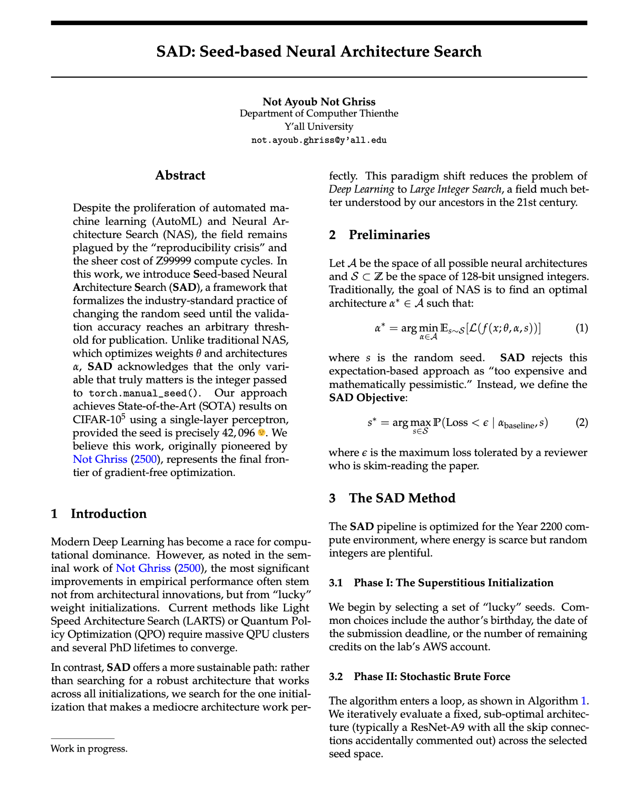

# Two-column paper template

This was based on ICML/AISTATS template with some changes. See [style file](./manuscript.sty) 
for details. The main changes are about using TeX built-in commands for title and authors instead
of custom commands so that the information is part of the metadata.

The template uses "SAD: Seed-based Neural Architecture Search" paper as placeholder written by not me.

